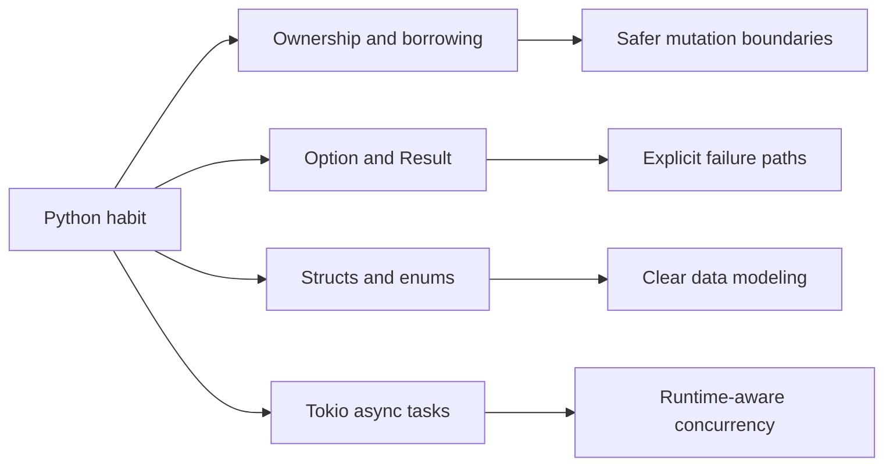

# Mental model map

Use this map when explaining why the Python-to-Rust move is really a change in data ownership, error contracts, and concurrency boundaries.

```mermaid
flowchart LR
  A["Python habit"] --> B["Ownership and borrowing"]
  A --> C["Option and Result"]
  A --> D["Structs and enums"]
  A --> E["Tokio async tasks"]
  B --> F["Safer mutation boundaries"]
  C --> G["Explicit failure paths"]
  D --> H["Clear data modeling"]
  E --> I["Runtime-aware concurrency"]
```
